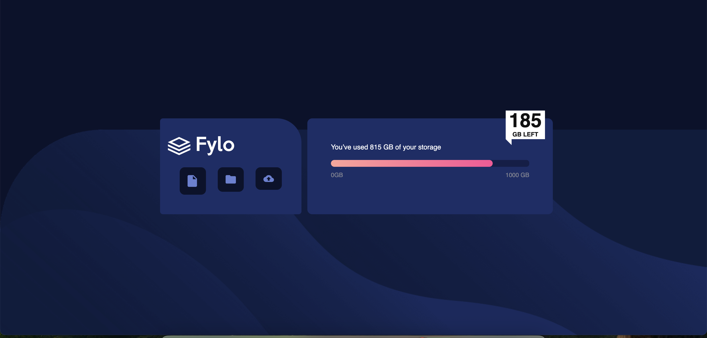

# Bootstrap Frontend Mentor (Remix)- Fylo data storage component

## Hello PS Teachers Here are some relevant links! 👋

[Github Repo: You are here!](https://github.com/4Drea4/AndreaE_SBA3)

Figma: Unfortunately I could not get this FIGMA file without purchasing pro. 

[Frontend Mentor Link to the project](https://www.frontendmentor.io/challenges/fylo-data-storage-component-1dZPRbV5n?tab=downloads) 

The process was trying but I learned a lot!

## Method
If I would have done it differently, I would have created the grid with the necessary utilities and then put the content in the "structure" first instead of building all at once. After I created the structure and filled in the content, I would have gone in and done any styling that I couldnt capture with Bootstrap. I think I would have had a much easier time. 

## Reflection

If I will be honest, I found bootstrap extremely difficult. I could not even get into a flow state. With a combination of grid, and bootstrap it took me much longer than it would in CSS to get everything together. Even as I am writing this, I just needed a break, I feel I am nearly done but I am dissapointed in the fact that I can not seem to get it close to the picture. The more I push in what I thought was correct according to Bootstrap the more that is conflicting. 
Some of my greatest struggles were applying the bootstrap grid, and staying organized within it due to the fact that I had one grid and within that grid I had another grid. In the previous assignment I was able to better understand where I could create the utility classes, and incorporate accessibility labels after going in layer by layer of what I created in CSS, in this instance it was difficult to build simply using the grid and adding the necessary utilities especially in terms of the spacing. 
I did my best to stay on the Bootstrap website and watch videos when the spacing was off, when I couldnt control the space, or the width with bootstrap. After I did all that I could, I think I plan on going in with CSS for specificity. 
